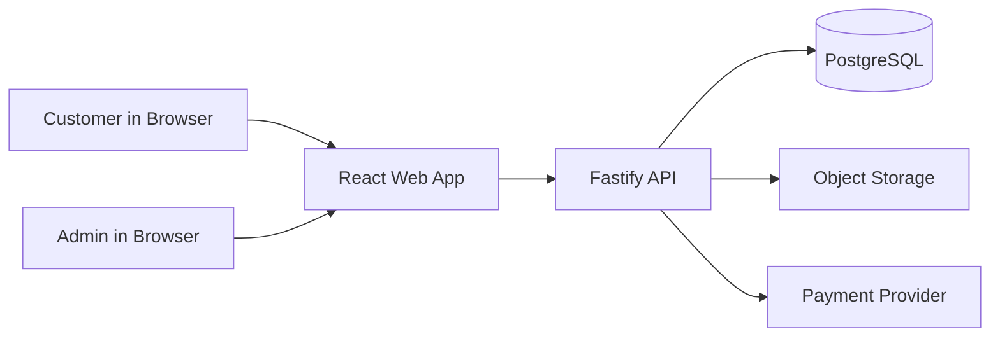
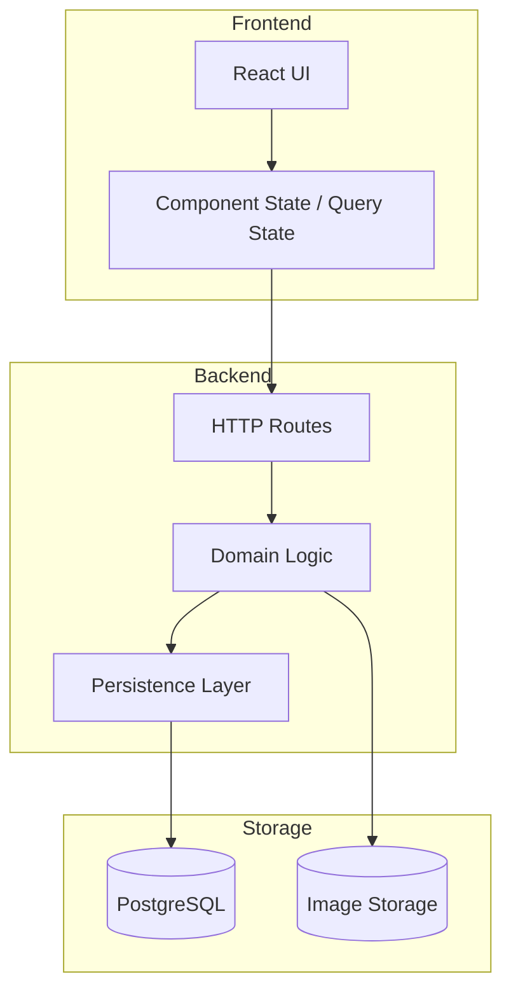
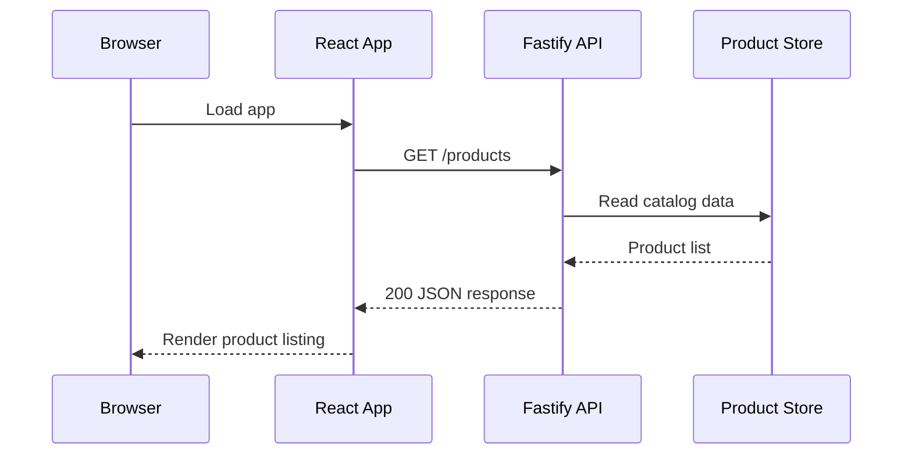

# Architecture

## Scope

This document defines the initial high-level architecture for a curated ecommerce platform for Japanese masks in India. It is intentionally lightweight: enough to guide implementation and scaling decisions without freezing the design too early.

## Goals

- keep the first version simple enough to reason about end to end
- preserve a clean path from in-memory data to persistent storage
- keep frontend and backend boundaries explicit
- support gradual scale without premature distributed complexity

## Non-Goals

- microservices in v1
- event-driven architecture in v1
- advanced search infrastructure in v1
- highly customized admin workflows in v1

## System Context

## Container View

## Initial Runtime Flow

## V1 Containers

### Frontend

- React + Vite
- responsible for rendering catalog, detail, cart, and later checkout flows
- owns presentation state and request lifecycle state

### Backend

- Fastify API
- responsible for catalog access, cart and checkout APIs, and later admin operations
- owns request validation, business logic, and persistence orchestration

### Database

- PostgreSQL when persistence is introduced
- source of truth for products, inventory, users, carts, orders, and admin-managed content

### Media Storage

- object storage later for product images
- CDN can be added later if traffic or asset size justifies it

## Domain Model V1

Core entities expected in the first scalable version:

- `Product`
- `ProductImage`
- `Category` or `MaskType`
- `Cart`
- `CartItem`
- `Order`
- `OrderItem`
- `User`

## Suggested Backend Module Shape

Once the app grows past the current single-file starter, organize by domain:

- `catalog`
- `cart`
- `checkout`
- `orders`
- `auth`
- `admin`

Within each domain:

- routes
- request/response schemas
- service logic
- repository or persistence access

This keeps the system aligned to business capabilities rather than framework folders alone.

## Suggested API Boundaries

Early read flows:

- `GET /products`
- `GET /products/:idOrSlug`

Later write flows:

- `POST /cart/items`
- `PATCH /cart/items/:id`
- `POST /checkout`
- `POST /admin/products`
- `PATCH /admin/products/:id`

## Scaling Assumptions

Expected early scaling path:

1. in-memory mock data
2. single Postgres-backed service
3. image/object storage
4. query optimization and caching where necessary
5. optional search service only when catalog size and filtering needs justify it

This is a scale-up path, not a premature scale-out path.

## Risks and Design Constraints

- product detail pages will likely become content-heavy, so schema design should allow structured storytelling fields
- image delivery can become the first practical bottleneck before API throughput does
- inventory and order writes require stronger consistency than catalog reads
- auth should not be introduced before browse, detail, and cart flows are stable

## MVP Roadmap

1. health check and app boot
2. catalog listing
3. product detail
4. cart
5. checkout simulation
6. persistent storage
7. admin product management
8. authentication and orders
