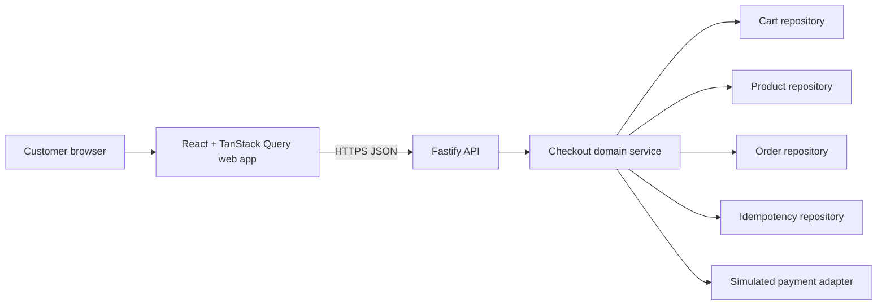
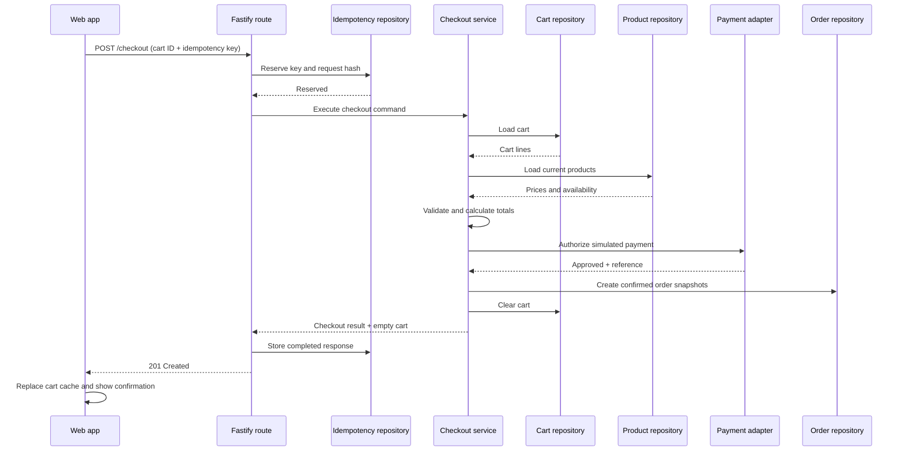

# Checkout High-Level Design

## Purpose

This document describes the checkout system boundary, major components, data ownership, runtime flow, and evolution path. Detailed request schemas and backend interfaces are defined in the API and LLD documents.

## Design Goals

- Complete a guest checkout without trusting client-calculated commerce data.
- Isolate carts between browsers.
- Prevent duplicate orders during retries.
- Preserve immutable order history even when products later change.
- Support an in-memory learning implementation while keeping PostgreSQL migration straightforward.
- Keep the initial system a modular monolith.

## Context



For the first milestone, repository adapters may use process memory. In the production path, cart, product, order, and idempotency repositories use PostgreSQL. The service and route interfaces remain unchanged.

## Component Responsibilities

### Web application

- Owns checkout form presentation and client-side validation.
- Reads the current cart through TanStack Query.
- Generates and retains an idempotency key for a submission attempt.
- Calls checkout through a TanStack mutation.
- Replaces the cart cache with the returned empty cart only after success.
- Navigates to a confirmation route with guest confirmation credentials.

### Fastify route layer

- Parses headers, parameters, and request body.
- Performs structural validation.
- Adds request context and passes commands to the domain service.
- Maps typed domain failures to the documented HTTP responses.
- Does not calculate totals or directly mutate repositories.

### Checkout service

- Orchestrates cart, catalog, payment, idempotency, and order operations.
- Performs authoritative availability and price validation.
- Applies the shipping policy and calculates totals.
- Enforces idempotency.
- Defines the transaction boundary.
- Returns a sanitized checkout result.

### Cart repository

- Loads an isolated cart by anonymous cart ID.
- Stores product ID and quantity as canonical cart-line fields.
- Clears one cart conditionally within checkout.
- Does not own product prices or order history.

### Product repository

- Supplies current product state and price.
- For the current model, exposes `inStock` only.
- Later owns numeric on-hand and reserved quantities.

### Order repository

- Creates orders and immutable order-item snapshots.
- Retrieves guest-safe confirmation views.
- Enforces unique order IDs and idempotency association.

### Idempotency repository

- Reserves a key for a cart and request hash.
- Stores in-progress, completed, and failed results.
- Prevents the same key from being used with another payload.

### Payment adapter

- Exposes a provider-neutral authorize interface.
- Maps simulation tokens to deterministic success or decline results.
- Never receives raw card details.
- Can later be replaced with a real provider adapter and webhook handler.

## Data Ownership

| Data | System of record | Notes |
| --- | --- | --- |
| Product price and availability | Product repository | Reloaded during checkout |
| Cart items and quantities | Cart repository | Scoped by anonymous cart ID |
| Shipping policy | Checkout domain configuration | Version policy changes where required |
| Customer/address snapshot | Order repository | Captured at checkout |
| Order item price/name snapshots | Order repository | Never joined dynamically for historical display |
| Payment result | Payment attempt/order storage | Provider-neutral reference only |
| Idempotency result | Idempotency repository | Retained for at least 24 hours |

## Successful Runtime Flow



With PostgreSQL, validation, order creation, inventory mutation, cart clearing, and idempotency completion occur inside one database transaction where possible. A real external payment provider will require a saga/reconciliation design because an external authorization cannot participate in the database transaction.

## Price-Change Flow

The frontend sends `expectedCartVersion` from its latest cart response. The backend reloads the cart and products and calculates the current summary. If the cart version differs or the calculated amount has changed:

1. no payment is attempted;
2. no order is created;
3. the cart is preserved;
4. the API returns `409 CART_CHANGED` with the refreshed cart summary;
5. the frontend updates the cart query cache and asks the customer to review changes.

## Idempotency Strategy

- Scope uniqueness by `(cartId, idempotencyKey)`.
- Hash a canonical representation of the validated request.
- First request reserves the key as `IN_PROGRESS`.
- A matching completed request returns the stored status and response.
- A matching in-progress request returns `409 CHECKOUT_IN_PROGRESS` and a retry hint.
- The same key with a different request hash returns `409 IDEMPOTENCY_KEY_REUSED`.
- Failed validation before reservation is not stored.
- Deterministic payment declines may be stored so retries return the same outcome.

## Anonymous Cart Identity

The current singleton cart is insufficient. The checkout milestone introduces:

1. `POST /carts` to create an anonymous cart;
2. a cryptographically random cart ID;
3. frontend persistence of that ID in local storage for the MVP;
4. `X-Cart-Id` on cart and checkout requests;
5. repository methods that always require a cart ID.

The cart ID is an identifier, not an authentication secret. Production should prefer a secure, same-site cookie or signed cart credential to reduce unauthorized cart access.

## Consistency Model

### In-memory milestone

- Supports one API process only.
- Uses synchronous repository mutation and rollback-safe ordering.
- Does not claim durability or cross-process concurrency safety.
- Exists to validate domain behavior and API integration.

### PostgreSQL milestone

- Uses a transaction and row-level locking for the cart and inventory records.
- Enforces unique idempotency keys and order IDs with database constraints.
- Clears the cart only if its locked version matches the checked-out version.
- Numeric inventory becomes a prerequisite for oversell protection.

## Security and Privacy

- Do not accept raw PAN, CVV, or expiry data.
- Validate payload sizes and normalize customer input.
- Rate-limit cart creation, checkout, and confirmation retrieval.
- Redact email, phone, address, confirmation token, and payment token from logs.
- Use opaque, high-entropy order and confirmation identifiers.
- Allow CORS only from configured frontend origins before deployment.
- Return generic internal errors with request IDs.

## Observability

Emit structured events:

- `checkout.started`
- `checkout.validation_failed`
- `checkout.cart_changed`
- `checkout.payment_declined`
- `checkout.completed`
- `checkout.failed`

Useful fields are request ID, cart ID, order ID, idempotency-key hash, result code, item count, amount, currency, and duration. Do not log customer or payment-token fields.

Initial metrics:

- checkout attempts and completion rate;
- validation and decline counts by error code;
- duplicate/idempotent request count;
- checkout latency percentiles;
- unexpected failure rate.

## Deployment Evolution

```text
Milestone 1: repository interfaces + in-memory adapters + simulated payment
Milestone 2: PostgreSQL carts/orders/idempotency + migrations + transactions
Milestone 3: numeric inventory and reservations
Milestone 4: real payment provider + webhooks + reconciliation
Milestone 5: authentication, fulfillment, cancellation, and refunds
```

## Key Risks

| Risk | Mitigation |
| --- | --- |
| Shared cart data | Introduce cart identity before checkout |
| Duplicate order on retry | Persist idempotency reservation and response |
| Stale client pricing | Recalculate and compare cart version server-side |
| Overselling | Do not claim quantity guarantees until numeric inventory and locking exist |
| Data loss on restart | Treat in-memory adapter as development-only; move orders to PostgreSQL |
| Payment succeeds but order fails | Not applicable to deterministic simulation; add reconciliation before real provider |
