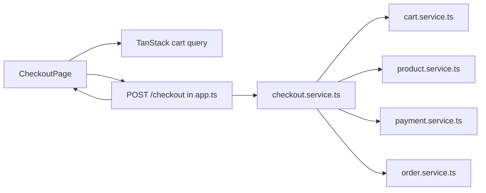
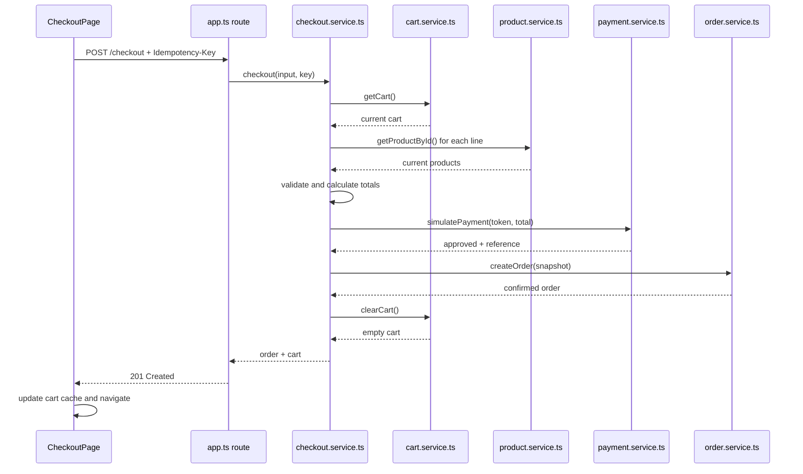

# Checkout High-Level Design

## Purpose

Describe how checkout fits into the repository as it exists today. This design intentionally extends the current flat `schemas/` and `services/` backend layout instead of replacing it with a new architecture.

## Current Repository Baseline

```text
product-catalog-api/src/
├── server.ts
├── schemas/
│   ├── cart.schema.ts
│   └── product.schema.ts
└── services/
    ├── cart.service.ts
    └── product.service.ts

product-catalog-web/src/
├── App.tsx
├── features/cart/
├── features/products/
└── lib/queryClient.ts
```

The API stores products and one cart in module-level arrays. Fastify routes are registered directly in `server.ts`. The frontend already uses TanStack Query for products and cart state.

## MVP Change Set

```text
product-catalog-api/src/
├── app.ts                            # new app factory; existing and new route registration
├── server.ts                         # keep process startup/listen/shutdown only
├── schemas/
│   ├── cart.schema.ts                # unchanged for MVP
│   ├── product.schema.ts             # unchanged for MVP
│   ├── checkout.schema.ts            # new checkout request types
│   └── order.schema.ts               # new order snapshot types
└── services/
    ├── cart.service.ts               # add clearCart()
    ├── product.service.ts            # reuse getProductById(); no required change
    ├── payment.service.ts            # new deterministic simulator
    ├── order.service.ts              # new in-memory order store
    └── checkout.service.ts           # new orchestration and idempotency

product-catalog-web/src/
├── App.tsx                            # add checkout and confirmation routes
├── features/cart/pages/CartPage.tsx  # add checkout action
└── features/checkout/                # new checkout UI, API, types, and pages
```

## Component Flow



## Responsibilities

### New `app.ts` and existing `server.ts`

- Move Fastify construction, CORS registration, current routes, and current error helpers from `server.ts` into an exported `buildServer()` function in `app.ts`.
- Preserve existing route behavior during the move.
- Register `POST /checkout` and `GET /orders/:id` in `app.ts`.
- Read `Idempotency-Key` from the request headers.
- Map `CheckoutServiceError` to HTTP responses and handle unknown order IDs explicitly.
- Keep business calculations out of route handlers.
- Keep `server.ts` responsible only for environment loading, calling `buildServer()`, listening, shutdown signals, and fatal startup errors.

### Existing `cart.schema.ts`

- No required MVP change.
- Its `Cart`, `CartItem`, and mutation input types remain the cart contract.
- Multi-cart IDs and cart versions are deferred and must be added here in the later multi-user increment.

### Existing `product.schema.ts`

- No required MVP change.
- `Product` remains the catalog type used to create order snapshots.
- Numeric inventory is deferred; `inStock` is the only availability check.

### Existing `cart.service.ts`

- Continue owning the module-level `cartItems` array.
- Add `clearCart(): Cart` that empties the array and returns `getCart()`.
- Do not clear the cart anywhere else in the checkout path.

### Existing `product.service.ts`

- Reuse `getProductById(productId)` to reload each cart product.
- No repository abstraction is required in this MVP.
- Product administration continues to mutate the same in-memory product objects.

### New `payment.service.ts`

- Convert an allowlisted simulation token into approved/declined behavior.
- Return a generated payment reference on approval.
- Never define or accept raw card fields.

### New `order.service.ts`

- Store confirmed order snapshots in a module-level array.
- Generate order IDs with `crypto.randomUUID()`.
- Provide `createOrder(input)` and `getOrderById(id)`.
- Never rebuild historical item data from the current product list.

### New `checkout.service.ts`

- Validate normalized checkout input.
- Read the current cart and reload current products.
- Build item snapshots and server-owned totals.
- Call simulated payment.
- Create the order, then clear the cart.
- Store successful idempotent results in a module-level map.

### New frontend checkout feature

- Render the form and current cart summary.
- Submit via a TanStack Query mutation.
- Reuse the same idempotency key for network retries.
- Put the returned empty cart into `cartKeys.current` after success.
- Navigate to `/orders/:id` and display the order query.

## Successful Sequence



## Failure Ordering

Operations occur in this order:

```text
validate input
→ read/validate cart
→ reload/validate products
→ calculate totals
→ simulate payment
→ create order
→ clear cart
→ cache idempotent result
```

Therefore validation, availability, and payment failures occur before order creation and cart clearing. Because storage is in memory and there is no transaction, `createOrder` and `clearCart` must remain synchronous and non-throwing after validation in this MVP. PostgreSQL implementation must replace this assumption with a transaction.

## Idempotency

`checkout.service.ts` maintains an in-memory map keyed by the request header value. Each value stores a stable request fingerprint and the completed result.

- Same key + same normalized input: return the stored result.
- Same key + different normalized input: throw `IDEMPOTENCY_KEY_REUSED`.
- Store only completed successful checkouts initially.
- A restart clears idempotency state; this is documented as an MVP limitation.

## Security Boundaries

- The API ignores client-supplied prices or totals because they are not part of the request.
- Logs must not include the full request body, address, phone, email, or payment token.
- CORS remains permissive for local development only.
- Order lookup is unprotected in this increment and must not be deployed publicly.
- No raw payment-card data is accepted.

## Observability

Use the existing Fastify logger with structured, non-PII fields:

- request ID;
- idempotency key hash or short prefix, never the complete key;
- order ID after creation;
- outcome/error code;
- total item count and total INR;
- duration.

## Later Architecture, Not Part of This LLD

When PostgreSQL and multiple shoppers are introduced:

1. add cart identity to `cart.schema.ts` and cart routes;
2. replace module arrays with repositories;
3. add numeric inventory and database transactions;
4. split the single `app.ts` route list into domain route plugins if it has become difficult to maintain;
5. persist idempotency records;
6. secure order access;
7. replace `payment.service.ts` with a provider adapter and webhook reconciliation.

Those changes are intentionally not prerequisites for the current checkout simulation.
